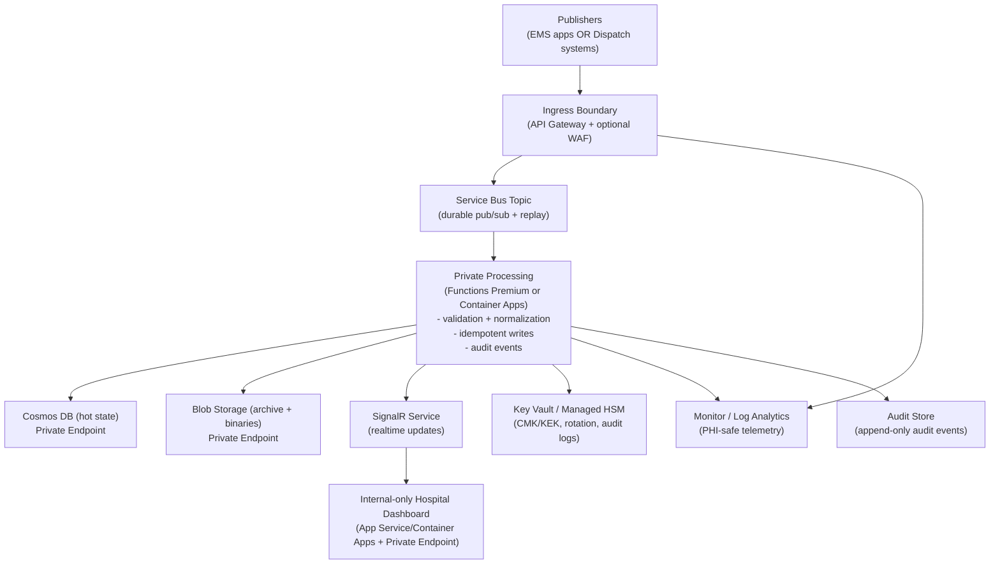
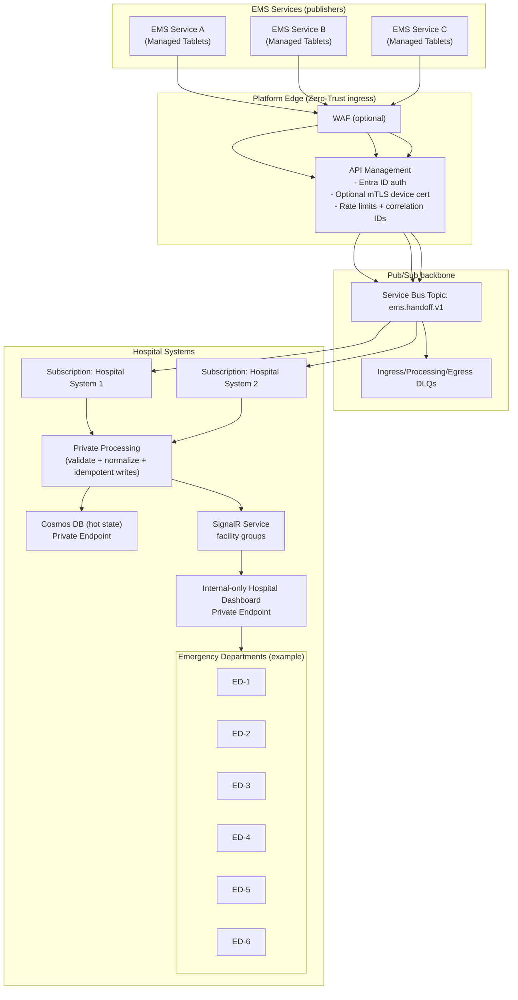
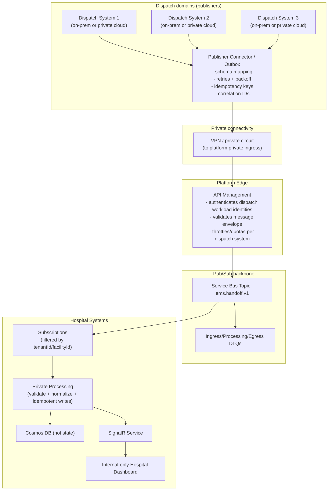

# Enterprise Production Architecture — EMS-to-ED PHI Pipeline

> Purpose: expand our simple, linear `ems-handoff-app` prototype into an enterprise-grade, city-level platform that supports **multiple EMS services** and **many receiving emergency departments**, while remaining **secure-by-default (Zero Trust)**, **HIPAA-aligned**, and **operationally scalable**.


---

## 1) Assumptions

### Key assumptions (generic)

- The hospital-facing dashboard is **internal-only** (reachable only from authorized hospital networks over private connectivity).
- “HIPAA-aligned” means **strict access controls + encryption + audited access + data minimization**.
- The platform runs in **dedicated environments** (Dev, Test/UAT, Prod) with strong isolation.
- Names, regions, and vendors are intentionally generic.

---

## 2) Common backbone (shared by all variants)

This section defines the city-scale platform backbone. The publishing model (EMS app vs dispatch integration) changes in later sections, but the backbone remains the same.

### 2.1 Logical network topology (private-by-default)

At enterprise scale, the platform uses a zero-trust layout:

- **Edge**: a single ingress boundary for authentication, throttling, and request correlation.
- **Backbone**: a durable pub/sub system for fan-out and replay.
- **Processing**: private compute that validates, normalizes, and writes state.
- **Data plane**: private endpoints for databases, storage, and key management.
- **Hospital access**: an internal-only dashboard reachable through private networking.



### Dedicated environments (required)

To reduce blast radius and enforce separation of duties:

- **Dev**: non-production data only; rapid iteration
- **Test/UAT**: production-like topology; synthetic data; release validation
- **Prod**: strict change control; least privilege; break-glass procedures

Recommended isolation patterns:

- Separate subscriptions (or at minimum separate VNets and resource groups) per environment.
- No shared Service Bus, Cosmos DB, Storage, or Key Vault between environments.
- Separate identities (app registrations / managed identities) per environment.

### 2.2 Data flow (durable events + hot state + realtime)

The backbone separates responsibilities:

- **Service Bus** is the durable event backbone (fan-out, ordering strategies, replay).
- **Cosmos DB** is the hot state store (fast hydration and current truth).
- **SignalR** is the realtime transport (low-latency updates), not the system of record.

#### End-to-end flow (generic)

1. A publisher submits a handoff event through the ingress boundary.
2. The ingress boundary authenticates and applies throttling/quotas.
3. The event is published to a Service Bus topic with routing properties.
4. A subscriber processing layer consumes the event and:
   - validates schema and required routing properties
   - applies an idempotent upsert to Cosmos DB hot state
   - emits facility-scoped realtime updates
   - writes audit events
5. Hospital dashboards:
   - hydrate current state from Cosmos DB
   - then consume realtime updates

#### Why this is safe

- If realtime updates are missed (disconnects), dashboards rehydrate from Cosmos DB.
- If processing fails, messages can be retried or dead-lettered without losing the event.

### 2.3 Pub/Sub model (routing at city scale)

#### Topic design

- Topic: `ems.handoff.v1`
- Message body: a validated clinical envelope (FHIR bundle or a wrapped envelope)
- Required message properties (example):
  - `tenantId` (hospital system)
  - `facilityId` (receiving ED)
  - `encounterId` (platform encounter)
  - `messageType` (created/updated/diverted/arrived/restored)
  - `schemaVersion`

#### Subscriptions and filters

Common enterprise pattern:

- One subscription per hospital system (tenant), optionally segmented by environment.
- SQL filters use message properties (not message body), primarily `tenantId` and `facilityId`.

### 2.4 Security model (HIPAA-aligned posture)

This backbone supports HIPAA-aligned safeguards via:

#### Compliance baseline (enterprise prerequisite)

- Execute a BAA with the cloud provider and ensure selected services are HIPAA-eligible for the workload.
- Define and enforce access policies (least privilege, separation of duties, break-glass access).

#### Identity + access control

- Workforce identity via Microsoft Entra ID.
- Conditional Access:
  - require MFA for privileged roles
  - require compliant devices for high-risk contexts
  - session controls and sign-in risk enforcement

#### Network isolation

- Private endpoints for Cosmos DB, Storage, and Key Vault/Managed HSM.
- Private DNS zones to keep name resolution internal.
- Hospital dashboard is internal-only via private access.

#### Encryption

- In transit: TLS 1.2+ everywhere.
- At rest: platform encryption; optional CMK where policy requires.
- Key management: Key Vault or Managed HSM with rotation and strict RBAC.

#### Data minimization and retention

- Never emit PHI in telemetry.
- Enforce TTL for hot operational data.
- Archive only what policy requires, for the policy-defined duration.

### 2.5 Logging, audit, and monitoring (who accessed PHI?)

This is the core of HIPAA-style audit controls.

#### PHI-safe telemetry rule

- Do not log PHI fields.
- Log only non-PHI identifiers and metadata:
  - `tenantId`, `facilityId`, `encounterId`, `messageType`, correlation IDs, timestamps, status/latency

#### Level 1 — Edge access logs (front door accountability)

Capture:

- authenticated principal (user/app)
- route + method
- scope (tenant/facility)
- status/latency
- correlation IDs

This is the best place to prove “who called what endpoint.”

#### Level 2 — Application audit events (who viewed/changed which encounter)

To answer “who accessed PHI,” record explicit application audit events such as:

- `handoffViewed`
- `handoffArrived`, `handoffDiverted`, `handoffRestored`
- `chatMessageSent`
- `dlqReplayRequested` / `dlqReplayExecuted`

Minimum fields:

- `actorId` (Entra user), `actorRole`, `actorOrg`
- `tenantId`, `facilityId`, `encounterId`
- `action`, timestamp, correlation ID

This is the most reliable mechanism for “user X viewed patient encounter Y.”

#### Level 3 — Service diagnostics (reliability and security ops)

- Service Bus: enqueue/dequeue, DLQ counts, processing latency
- Compute: execution logs, dependency calls, failures, retries
- Cosmos DB: RU usage, latency, throttles (`429`), availability
- Storage: read/write metrics and failure diagnostics

These logs typically identify the workload identity rather than the human.

#### Level 4 — CMK / key-operation auditing (who used the keys)

If using CMK:

- Key Vault / Managed HSM logs show key operations (wrap/unwrap/decrypt) and which managed identity performed them.
- This is strong evidence of “which service decrypted,” but not typically “which human viewed,” unless you design per-user cryptographic boundaries.

#### Correlation strategy

Use a single correlation ID per request/event:

- issued at ingress
- stamped into Service Bus message properties
- propagated through processing logs
- attached to audit events

This makes incident response and compliance investigations practical.

### 2.6 Durability and reliability (DLQs, replay, idempotency)

Enterprise correctness depends on these rules:

- Every handler is **idempotent** (safe to retry).
- Every state-changing operation has a deterministic idempotency key.
- DLQ replay is privileged, audited, and time-bound.

Publisher durability pattern (recommended):

- Use an **outbox** pattern for publishers that cannot lose events.
  - For example, a dispatch connector writes outbound events to a local durable queue/store first, then publishes to the platform with retries.
  - This prevents a transient network outage from becoming data loss.

Recommended DLQ categories:

- **Ingress DLQ**: invalid schema, missing routing properties, unauthorized scope
- **Processing DLQ**: transient failures that exceeded retries
- **Egress DLQ**: failures pushing outbound updates (rarely the source of truth)

### 2.7 Scalability and resiliency

Scaling is achieved through controlled backpressure:

- Ingress applies quotas and throttles.
- Service Bus absorbs burst traffic.
- Processing scales horizontally.
- Cosmos DB scales through partitioning + RU planning.

Cosmos DB scale notes (generic but important):

- Avoid a low-cardinality partition key that can hotspot a large receiving facility.
- Prefer a partitioning strategy aligned to access patterns (commonly tenant + facility).
- Consider Hierarchical Partition Keys (HPK) when you need better distribution or to avoid single logical partition constraints.
- Plan for throttling (`429`) and retries, and monitor RU consumption and latency.
- Remember the 2 MB max item size; keep hot state small and store large payloads (documents, ECGs, images) in object storage.
- Embed vs reference intentionally: embed small fields frequently read together; reference large or frequently changing subdocuments.
- Capture and retain Cosmos SDK diagnostics for unexpected latency/errors to speed up production triage.

Reconnect correctness is structural:

- dashboards always rehydrate from Cosmos hot state
- realtime is incremental, not authoritative

### 2.8 Multi-AZ and disaster recovery (generic)

Plan for two failure classes:

1. Availability Zone failure (in-region)
2. Regional failure (cross-region)

Minimum expectations:

- Prefer zone-redundant services where supported.
- Define RTO/RPO targets explicitly.
- Maintain runbooks and practice failover.

Practical DR plan elements (kept generic):

- **Ingress failover**: a standby ingress endpoint in a secondary region, activated through DNS/traffic routing when the primary region is unavailable.
- **Backbone failover**: messaging namespace recovery/failover strategy with a documented cutover procedure.
- **Hot state failover**: multi-region replication (or a restore strategy) that meets the agreed RPO.
- **Archive durability**: geo-redundant storage posture aligned to retention and recovery needs.
- **Key management**: ensure keys, access policies, and auditing remain available during regional failover.
- **Internal dashboard continuity**: the internal-only hospital dashboard must have a tested path to reach the secondary region (network routing + private connectivity).

### 2.9 Tenancy and data-plane isolation model (explicit)

Make the isolation boundary unambiguous. At enterprise scale, “multi-hospital” is not only a UI concern — it is an authorization, networking, and data-plane concern.

Define whether hospital systems are isolated by subscription/resource group, by VNet, by separate messaging namespaces, and/or by separate data accounts/containers. Regardless of topology, enforce end-to-end scope checks using tenant/facility identifiers and claims (issuer → ingress → message properties → processing authorization → Cosmos/Blob access), and treat cross-tenant data access as a hard security failure.

### 2.10 Schema and contract governance (versioning + compatibility)

City-wide systems fail most often from contract drift. Publish a versioned contract for (1) the message envelope and routing properties and (2) the clinical payload(s), with explicit backward/forward compatibility rules.

Operationally, require a gated rollout for breaking changes (dual-publish window, consumer compatibility testing, and a deprecation timeline). Keep schema validation as a “bouncer” (reject malformed data with clear errors) so only contract-compliant events enter the backbone.

### 2.11 Operational readiness (SLOs, runbooks, drills)

Architecture becomes “enterprise-grade” when it is measurable and operable. Define a small set of SLOs that reflect clinical reality (ingress success rate, time-to-dashboard freshness, DLQ backlog age, and archive success rate), then wire alerts to those outcomes.

Maintain runbooks for the recurring failure modes: DLQ triage, replay approval/execution, throttling mitigation, partial outage behavior, and data correction workflows. Practice game days (zone outage simulation + controlled replay drill) so the organization can execute under stress.

### 2.12 Security governance and continuous enforcement (policy-as-code)

Treat “private-by-default” and “no public access on data services” as continuously enforced policy, not a one-time design choice. Use policy baselines to deny drift (public endpoints, missing diagnostics, weak TLS, overly permissive identities) and to standardize logging/audit routing.

Pair this with security operations: posture monitoring, SIEM integration, break-glass procedures, and periodic access reviews. This is what turns HIPAA-style safeguards into an auditable, repeatable program.

### 2.13 Archive governance (immutability, legal hold, purge)

The prototype already distinguishes “hot state” vs “archive.” At enterprise scale, add governance around the archive lifecycle: when immutability/WORM is required, how legal hold is applied/released, and how retention is enforced consistently.

Equally important is purge: define what “delete” means (hot + archive + derived indices), how deletes are authorized and audited, and how you can prove deletion occurred without exposing PHI (e.g., by logging encounter IDs, timestamps, and policy references).

---

## 3) Variant A — EMS-managed app as publisher

This variant is closest to the current prototype direction: EMS users submit structured PHI through an EMS-managed app.

### 3.1 What changes vs the backbone

- Publishers are EMS devices/users.
- The platform owns the EMS UX and can enforce a strict clinical data contract.
- The platform can directly authenticate EMS users and produce first-party user-level audit events.

### 3.2 Topology example (3 EMS services → 6 emergency departments)

This is an example. It scales by adding EMS services and ED facilities.



### 3.3 Data flow (what the EMS app enables)

Because the platform owns the EMS UX, it can:

- enforce required fields and validation rules
- collect standardized, structured clinical data
- support destination-specific workflows (facility-defined requirements)

Typical flow:

1. EMS user submits a structured payload.
2. Ingress validates identity and publishes an event.
3. Processing validates, writes hot state, and pushes realtime updates.
4. Hospital dashboards hydrate and display a consistent dataset.

### 3.4 Security and audit (variant-specific)

- Strongest alignment for user-level auditing on the publisher side.
- Optional mTLS can provide a “trusted device certificate” control, but increases certificate lifecycle overhead.

### 3.5 Onboarding and operations

This model requires ongoing product operations:

- device management / compliance posture
- EMS training and support
- UX and schema versioning

---

## 4) Variant B — Dispatch systems as the sole publishers (hybrid, multi-dispatch)

This variant uses the same backbone but shifts publishing to one or more dispatch systems. EMS users chart into dispatch workflows they already use, and dispatch publishes inbound events.

### 4.1 What changes vs the backbone

- Publishers are dispatch systems (workload identity), not EMS devices.
- EMS user authentication and origin audit trail live in dispatch.
- The platform inherits upstream schema constraints unless dispatch publishes a normalized envelope.

### 4.2 Topology example (multiple dispatch publishers)



### 4.3 Data flow (dispatch-originated events)

1. Dispatch creates/updates an incident record.
2. A dispatch connector builds a normalized message envelope and publishes it through private ingress.
3. The platform authenticates dispatch as a workload identity and publishes to Service Bus.
4. Hospital subscriptions process events, update hot state, and push realtime updates.
5. Dashboards rehydrate from Cosmos and receive incremental updates.

### 4.4 Security and audit (variant-specific)

This model relies on two linked audit trails:

- Origin audit trail (dispatch): who entered/updated PHI
- Distribution audit trail (platform + hospitals): who published, who viewed

To link them, include stable identifiers in every message:

- `dispatchSystemId`
- `incidentId` (dispatch identifier)
- `encounterId` (platform identifier)
- correlation ID
- `sequenceNumber` (for idempotency and ordering)

### 4.5 Onboarding dispatch systems (scales by integration)

Treat dispatch onboarding like an enterprise integration program:

1. Publish a versioned message contract (envelope + required properties).
2. Provision a dedicated dispatch workload identity.
3. Establish private connectivity and private ingress.
4. Apply per-dispatch quotas, allowlists, and monitoring.
5. Validate end-to-end with synthetic data in Test/UAT before enabling Prod.

---

## 5) Comparison and decision guidance

Both variants use the same backbone. The decision is primarily about **publisher control, operational burden, and clinical contract ownership**.

### 5.1 Comparison table (high-level)

| Dimension | Variant A: EMS-managed app publisher | Variant B: Dispatch publisher |
|---|---|---|
| Clinical control over collected/displayed PHI | Highest (facility-defined requirements can be enforced in the EMS UX) | Lower (inherits dispatch capture model unless dispatch publishes a rich normalized envelope) |
| EMS workflow change | Higher (new app + training) | Lower (piggybacks on existing dispatch workflow) |
| Ongoing product operations | Higher (device, UX, support, upgrades) | Lower on EMS side; higher integration governance with dispatch vendors |
| Publisher count at ingress | High (many devices) | Lower (few dispatch systems) |
| Origin audit trail (“who entered what”) | Platform can be first-party | Primarily dispatch-owned; platform must link via identifiers |
| Dependency risk | Less dependent on dispatch | Dispatch integration is a critical dependency |
| Time to expand to new agencies | Medium (roll out app) | Potentially fast once a dispatch system is integrated |

### 5.2 Pros and cons (detailed)

#### Variant A — EMS-managed app publisher

Pros:

- Strongest ability to let receiving clinical leadership define what PHI is collected and displayed.
- Highest data consistency (strict validation + guided UX + controlled vocabularies).
- Cleaner end-to-end audit semantics (publisher identity is the actual user).

Cons:

- Highest frontline adoption and support burden (new workflow, training, device posture management).
- More edge cases (offline, poor connectivity, device variance).
- Requires sustained product investment.

#### Variant B — Dispatch publisher

Pros:

- Leverages an existing backbone; reduces EMS app management.
- Onboards publishers at the system level (dispatch systems), not per device.
- Often faster to scale across agencies once dispatch integration is established.

Cons:

- Clinical data contract is constrained by dispatch capture model.
- Vendor variability and schema churn require strong governance.
- Dispatch becomes a critical dependency for hospital visibility.

### 5.3 Recommended decision approach

Choose Variant A when:

- clinical teams need to define and enforce a high-fidelity dataset
- the program can support EMS app rollout and training
- the platform must produce first-party origin auditing

Choose Variant B when:

- the primary goal is rapid rollout with minimal EMS workflow change
- dispatch systems can reliably provide the necessary clinical fields
- your organization is prepared to run a formal dispatch integration/onboarding program

---

## Appendix A — Component checklist (common enterprise additions)

- WAF + DDoS protection where required
- Private DNS zones + egress control (firewall/NAT strategy)
- Azure Policy baselines (deny public access on data services)
- Defender for Cloud posture management
- SIEM integration (optional, common)
- Key rotation process + break-glass access
- Backup/restore strategy + incident response runbooks

## Appendix B — Mapping our prototype to enterprise

- Prototype strengths to keep: schema validation, idempotent writes, write-before-delete archival safety, realtime updates.
- Enterprise upgrades: private-by-default topology, pub/sub backbone, internal-only dashboard, dedicated environments, auditing, partitioning strategy, and DR operations.

---

## Appendix C — Example message envelope (PHI-safe)

Use a normalized envelope so routing, auditing, idempotency, and replay can work **without** inspecting or logging PHI.

Principles:

- Put routing + governance fields in the envelope.
- Keep clinical payload separate when large (store in object storage and reference it).
- Do not include patient name/DOB/address or other PHI in the envelope.

Example (event on Service Bus):

```json
{
  "schemaVersion": "1.0",
  "messageType": "handoff.upserted",
  "occurredAt": "2026-03-19T22:41:05Z",

  "tenantId": "city-ems-program",
  "facilityId": "hospital-system-1:ed-3",
  "encounterId": "enc_8f5b2fdb",

  "producer": {
    "producerType": "emsApp",
    "producerId": "ems-service-a",
    "workloadId": "<entra-app-or-mi-object-id>"
  },

  "origin": {
    "dispatchSystemId": null,
    "incidentId": null
  },

  "sequenceNumber": 184,
  "idempotencyKey": "enc_8f5b2fdb:handoff.upserted:184",
  "correlationId": "cor_2c7d1b0b5b3d4c8e",

  "payload": {
    "mode": "inline",
    "contentType": "application/json",
    "inline": {
      "contract": "handoff-summary-v1",
      "fields": {
        "acuity": "high",
        "etaMinutes": 7
      }
    }
  },

  "replay": {
    "isReplay": false,
    "replayRequestedBy": null,
    "replayReason": null
  }
}
```

Example (payload stored in object storage, envelope references it):

```json
{
  "schemaVersion": "1.0",
  "messageType": "handoff.bundle.created",
  "occurredAt": "2026-03-19T22:41:05Z",
  "tenantId": "city-ems-program",
  "facilityId": "hospital-system-1:ed-3",
  "encounterId": "enc_8f5b2fdb",
  "sequenceNumber": 185,
  "idempotencyKey": "enc_8f5b2fdb:handoff.bundle.created:185",
  "correlationId": "cor_2c7d1b0b5b3d4c8e",
  "payload": {
    "mode": "reference",
    "contentType": "application/fhir+json",
    "reference": {
      "storage": "blob",
      "uri": "https://<storage-account>/<container>/tenants/city-ems-program/facilities/hospital-system-1/encounters/enc_8f5b2fdb/bundles/185.json",
      "sha256": "<hex>",
      "byteLength": 48211
    }
  }
}
```

Notes:

- For Variant B (dispatch publisher), populate `origin.dispatchSystemId` + `origin.incidentId`, and set `producer.producerType` to `dispatch`.
- For subscription filtering, use message properties mirroring `tenantId` and `facilityId`.
- If your organization classifies patient identifiers (MRN, patient ID) as PHI, keep them out of the envelope and store them only inside the clinical payload with appropriate access controls.

---

## Appendix D — Example application audit event schema (PHI-safe)

Service logs typically show **workload identity**; application audit events are how you prove **human user** actions like “viewed encounter.”

Principles:

- Do not record PHI in audit events.
- Prefer append-only storage and immutable retention controls where required.
- Make audit events linkable to edge logs and message processing via `correlationId`.

Recommended event shape:

```json
{
  "schemaVersion": "1.0",
  "eventType": "handoffViewed",
  "occurredAt": "2026-03-19T22:42:12Z",

  "actor": {
    "actorType": "human",
    "actorId": "<entra-user-object-id>",
    "actorDisplay": "<optional-non-PHI-display>",
    "actorRole": "EDChargeNurse",
    "actorOrg": "hospital-system-1"
  },

  "target": {
    "resourceType": "handoff",
    "tenantId": "city-ems-program",
    "facilityId": "hospital-system-1:ed-3",
    "encounterId": "enc_8f5b2fdb"
  },

  "authContext": {
    "clientAppId": "<entra-app-id>",
    "sessionId": "<session-id>",
    "deviceId": "<managed-device-id>",
    "ipHash": "<sha256-of-client-ip-or-null>"
  },

  "operation": {
    "result": "success",
    "reason": null
  },

  "correlationId": "cor_2c7d1b0b5b3d4c8e",
  "trace": {
    "requestId": "req_0f7a...",
    "messageId": "sbmsg_9d2a..."
  }
}
```

Example audit event for a privileged action (replay):

```json
{
  "schemaVersion": "1.0",
  "eventType": "dlqReplayExecuted",
  "occurredAt": "2026-03-19T23:01:44Z",
  "actor": {
    "actorType": "human",
    "actorId": "<entra-user-object-id>",
    "actorRole": "PlatformOps",
    "actorOrg": "city-ems-program"
  },
  "target": {
    "resourceType": "message",
    "tenantId": "city-ems-program",
    "facilityId": "hospital-system-1:ed-3",
    "encounterId": "enc_8f5b2fdb"
  },
  "operation": {
    "result": "success",
    "reason": "validated schema mismatch fix; approved replay window"
  },
  "correlationId": "cor_5f9c2d6c3f9a4a11"
}
```
